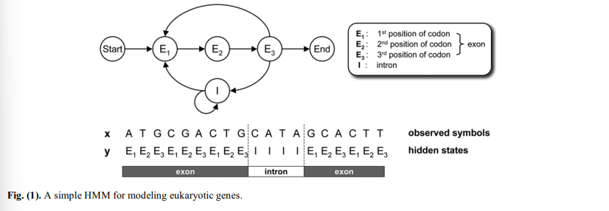
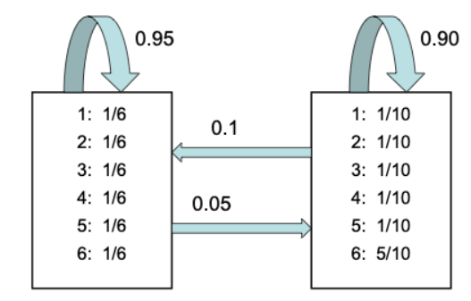

```{r setup, include=FALSE}
knitr::opts_chunk$set(echo = TRUE)
setwd(dirname(rstudioapi::getActiveDocumentContext()$path))
```

# Introducción
### Definición del modelo

\textbf{Objetivo}: Los Hidden Markov Models (HMM) son muy populares por su efectividad a la hora de modelizar la correlación entre eventos, símbolos, etc. Especialmente en el reconocimiento del discurso. A su vez los HMM son útiles en numerosos problemas de secuenciación biológica. Como, por ejemplo, en predicción de genes, modelización de errores de secuenciación del ADN, alineamiento de secuencias...

### Definición del modelo

Para definir un HMM se requieren dos procesos estocáticos: \pause

\begin{block}{Definición}

Un HMM está compuesto de una secuencia de símbolos $\textbf{x}=x_1x_2\dots x_L$ y del conjunto subyacente de estados ocultos $\textbf{y}=y_1y_2\dots y_L$.
Donde cada símbolo $x_n$ se toma de entre un número finito de posibles valores del conjunto de observaciones $O=\{O_1,O_2,\dots,O_N \}$, y cada estado $y_n$ toma un valor del conjunto de estados $S=\{1,2,\dots M \}$ donde $N$ y $M$ denotan el número de observaciones distintas y de estados distinto en el modelo.
\end{block}

### Definición del modelo

Suponemos que la secuencia de estados ocultos es una cadena de Markov de primer órden homogénea. Esto implica que la probabilidad de acceder al estado j en el siguiente instante depende solo del estado i inicial, y que su probabilidad no cambia con el tiempo. \pause

\begin{block}{Propiedad markoviana}
$$
P(y_{n+1}=j \ | \ y_n = i, y_{n-1}=i_{n-1},\dots,y_1=i_1) = 
$$
$$
= P(y_{n+1}=j \ | \ y_n=i)=t(i,j)
$$
\end{block} \pause

para todos los estados $i,j\in S$ y $\forall n \geq 1$. Llamaremos a $t(i,j)$ la *probabilidad de transitar del estado i al estado j*.

### Definición del modelo

También para el estado inicial $y_1$ se define la *probabilidad de estado inicial* como: \pause

\begin{block}{Probabilidad de estado inicial}
$$
\pi(i)=P(y_1=i); \ \forall i\in S
$$
\end{block}

### Definición del modelo

Además la probabilidad que la observación n-ésima sea $x_n=x$ depende únicamente en el estado subyacente $y_n$, esto es,\pause

\begin{block}{Probabilidad de emisión}
$P(x_n=x \ | \ y_n=i,y_{n-1},\dots)=P(x_n=x \ | \ y_n = i) = e(x|i)$
\end{block} \pause

para todas las posibles observaciones $x=O$, $\forall i\in S$ y $\forall n\geq1$. A esto se lo llamará la *probabilidad de emisión de x en el estado i*, y lo denotaremos por $e(x|i)$. \pause

Con estas tres probabilidades, $t(i,j),\pi(i),e(x|i)$ tenemos completamente definido el HMM. A este conjunto de probabilidades lo denotaremos por $\Theta$.


### Planteamiento del problema

Habiendo definido $\Theta$ podemos calcular la probabilidad de que el HMM genere la secuencia observada $x=x_1x_2\dots x_L$ con la cadena de estados subyacente $y=y_1y_2\dots y_L$. Esto es, \pause

\begin{block}{Probabilidad conjunta}
La probabilidad conjunta $P(x,y|\Theta)$ viene dada por:

$$
P(x,y|\Theta)=P(x|y,\Theta)P(y|\Theta)
$$
donde
$$
P(x|y,\Theta)=e(x_1|y_1)e(x_2|y_2)\dots e(x_L|y_L)
$$
$$
P(y|\Theta)=\pi(y_1)t(y_1,y_2)t(y_2,y_3)\dots t(y_{L-1},y_L).
$$
\end{block} \pause

Algo importante es que se puede calcular la probabilidad de la observación si se conoce la secuencia subyacente de estados.

# Un HMM para modelizar genes en eucariotas

###

Recordemos que los HMMs son muy eficientes a la hora de representar secuencias biológicas. 
En nuestro caso, vamos considerar un HMM que modelice la secuencia de proteínas en los genes en eucariotas. \pause

\begin{block}{Proteína}
Las proteínas son macromoléculas formadas por cadenas lineales de aminoácidos.
\end{block} \pause

\begin{block}{Codón}
Un codón es una secuencia de ADN o ARN compuesto por tres nucleótidos que forma una unidad de información genómica que codifica para un aminoácido determinado o señaliza la terminación de una síntesis de proteína.
\end{block}

### ¿Por qué un HMM?

Está demostrado la existencia de sesgo de codones en función de las distintas regiones en la estructura de una proteína. Esta no-uniformidad en el uso de los codones se traduce en diferentes probabilidades en los signos para diferentes posiciones de codón. \pause

\begin{block}{}
Esta propiedad no es observable en los intrones, por tanto, no es trasladada al aminoácido.
\end{block} \pause

Los genes son secuencias de ADN que contienen la información necesaria para la producción de proteínas. Estos están compuestos por secuencias exónicas e intrónicas.

### Ejemplo

 \pause

En este caso, nuestro modelo cuenta con tres estados ocultos $E_1, \ E_2, \ E_3$ que son los que modelan las probabilidades en los exones.Cada $E_k , \ con \  k\in \{1 , 2, 3\}$ emite distintas probabilidades de símbolo en la posición $k$ del codón. 

### Ejemplo

El estado $I$ se utiliza para modelizar las probabilidades en los intrones.

Con este modelo se podrán tener en cuenta genes con múltiples exones, donde cada uno tiene un número variable de codones, y donde los intrones pueden tener distintas longitudes.

### Ejemplo

Ahora podemos analizar nuevas secuencias. Por ejemplo, supongamos la secuencia de ADN siguiente,

\begin{block}{}
$$
x=x_1\cdots x_{19}=ATCGCGACTGCATAGCACTT
$$
\end{block} \pause

Y queremos averiguar si esta secuencia de ADN es un gen codificador. O si asumieramos que $x$ es un gen codificador de proteínas, ¿podemos predecir la localización de los exones e intrones en la secuencia dada?

### 

Para el primer problema basta con plantear la probabilidad de observación de $x$ basado en el HMM. Si la probabilidad es alta, significará que, probablemente, la secuencia de ADN será un gen codificador.
La segunda pregunta, consiste en un problema de predicción de la estructura interna de la secuencia, ya que no puede ser observada. Por tanto, podemos predecir la secuencia de estado $y$ que mejor describa $x$.


# Problemas básicos y algoritmos para HMMs

## Scoring problem

### El *scoring problem*

Igual que planteamos el ejemplo de las eucariotas podemos abstraernos y proponer tres problemas básicos de uso de los HMMs. \pause

Supongamos que tenemos una nueva secuencia de símbolos $\textbf{x}=x_1x_2\dots x_L$ y queremos conocer la probabilidad de esta observación, es decir, $P(x|\Theta)$

\begin{block}{Recordatorio}
$$
\Theta = \{t(i,j), \pi (i), e(x|i) \}; \ \forall i,j\in S
$$
\end{block} \pause

A este problema se le suele llamar el *scoring problem*, ya que dicha probabilidad es una manera de 'puntuar' una nueva secuencia de observaciones $x$ basándonos en el modelo. 

###

\begin{block}{Observación}
Dado un $\textbf{x}$, su secuencia de estados subyacente no es directamente observable y pueden existir distintas secuencias de estados que devuelvan $\textbf{x}$
\end{block} \pause

Esto nos da una pista de cómo computar la probabilidad de observación. 

\begin{block}{Probabilidad de observar $x$}
$$
P(x|\Theta)=\sum_yP(x,y|\Theta)
$$
\end{block} \pause

Aun así, esta forma es muy costosa computacionalmente. Hay del orden de $M^L$ posibles secuencias de estados.

### Forward algorithm (Algoritmo de avance)

Definimos la siguiente variable de avance, \pause
$\alpha(n,i)=P(x_1\dots x_n,y_n=i|\Theta).$

La fórmula de cálculo recursiva sería la siguiente,

$$
\alpha(n,i)=\sum_k[\alpha(n-1,k)t(k,i)e(x_n|i)]; \ para \ n=2,\dots,L.
$$ \pause
Una vez realizado el cálculo podemos obtener la probabilidad de observación, 
$$
P(x|\Theta)=\sum_k\alpha(L,k)
$$
En este caso, el coste de cálculo pasa a ser $O(LM^2)$.

## El problema de alineamiento óptimo

Otro problema importante es el de encontrar la secuencia de estados óptimos en el HMM que maximice la probabilidad de observación de la secuencia de símbolos $x$ dada. \pause

\begin{block}{Optimal alignment}
Buscamos el camino óptimo $y^*$ que satisface:
$$
y^*=\underset{y}{\operatorname{arg\ máx}}\ P(y|x,\Theta)
$$
Vemos que esto es idéntico a encontrar la secuencia de estados que maximiza $P(x,y|\Theta)$ puesto que,
$$
P(y|x,\Theta)=\frac{P(x,y|\Theta)}{P(x|\Theta)} \propto P(x,y|\Theta)
$$
\end{block}

Una vez más, comparar $M^L$ combinaciones no es rentable.

### El algoritmo de Viterbi

En este caso, se hace uso del *algoritmo de Viterbi*. Este algoritmo define,
$\gamma(n,i)=\underset{y_1,\dots,y_{n-1}}{\operatorname{máx}}P(x_1,\dots, x_n,y_1,\dots,y_n=i|\Theta)$, \pause

Y utilizamos la fórmula de cáculo recursiva,

$$
\gamma(n,i)=\underset{k}{\operatorname{máx}}[\gamma(n-1,k)t(k,i)e(x_n|i)].
$$
Así una vez terminado, podemos obtener la máxima probabilidad, 
$$
P^*=\underset{y}{\operatorname{máx}}P(x,y|\Theta)=\underset{k}{\operatorname{máx}}\gamma(L,k).
$$ \pause

El $y^*$ que maximice será nuestro camino óptimo e igual que el anterior algoritmo reducimos el tiempo al orden de $O(LM^2)$.


###

En algunos casos nos podrá interesar conocer el estado óptimo para cada símbolo antes que toda la secuencia de estados. \pause

Entonces, queremos encontrar el estado óptimo $y_n$ que es más probable que subyace al símbolo $x_n$, como una probabilidad a posteriori de la siguiente forma:

$$
\hat{y}_n=\underset{i}{\operatorname{arg\ max}}P(y_n=i|x,\Theta).
$$ \pause
De donde sigue que,
$$
P(y_n=i|x,\Theta)=\frac{P(x_1,\dots,x_n,y_n=i|\Theta)P(x_{n+1},\dots,x_L|y_n=i,\Theta)}{P{x|\Theta}}=
$$
$$
=\frac{\alpha(n,i)\beta(n,i)}{\sum_k \alpha(n,k)\beta(n,k)}.
$$

###

Donde $\beta(n,i)$ es de la forma, $\beta(n,i)=P(x_{n+1},\dots,x_L|y_n=i,\Theta)$.
Esta se calcula con la fórmula recursiva, \pause

$$
\beta(n,i)=\sum_k[t(i,k)e(x_{n+1}|k)\beta(n+1,k)];\ para\ n=L-1,L-2,\dots,1.
$$ \pause
Es claro que predecir individualmente cada estado óptimo maximizará el número esperado de predicciones de estados correctas. \pause

Pero, en conjunto, $\hat{y}=\hat{y}_1\hat{y}_2\dots\hat{y}_L$ generalmente será menos óptimo.

\begin{block}{}
$$
P(x,\hat{y}|\Theta)\leq P(x,y^*|\Theta)
$$
\end{block}
Incluso puede no ser un un camino legítimo, en cuyo caso tendremos $P(x,\hat{y}|\Theta)=0$.

## Training problem

### El *training problem*

El problema de scoring y el problema de alineación consiste en el análisis de una nueva secuencia observada $x$ basándonos en un HMM dado. Es decir, que estos problemas requieren de un HMM que represente correctamente las secuencias de nuestro interés. \pause

Supongamos ahora que tenemos $X=(x_1,x_2,\dots,x_T)$ un conjunto de secuencias observadas que queremos representar con un HMM.

- Diferentes grabaciones de la misma palabra.
- Secuencias de proteínas que pertenecen a la misma familia funcional.

\begin{block}{Objetivo}
Elegir bien los parámetros del modelo basándonos en las observaciones
\end{block}

### El *training problem*

\begin{block}{Observación}
Se debe tener en cuenta que los anteriores problemas son posibles de resolver porque se conoce el HMM que puede representar correctamente la secuencia de nuestro interés.
\end{block} \pause

El problema de entrenamiento consiste como elegir adecuadamente los parámetros del HMM basándonos en una observaciones. 

###

Aunque no hay una forma óptima de estimar los parámetros para un número de secuencias observadas finitas, existen maneras de encontrar los parámetros que maximicen la probabilidad observada localmente. \pause

Podemos usar, por ejemplo, el algoritmo  de Baum-Welch para entrenar el HMM. Este es un algoritmo EM (expectation-maximization) que estima iterativamente y actualiza $\Theta$ basándose el el procedimiento de avance y retroceso.

## Variantes de los HMMs

### Variantes de los HMMs

- Añadir estados de silencio, es decir estados que no emiten ningún símbolo.
- Que los estados emitan dos símbolos alineeados, de manera que el HMM genere dos secuencias de símbolos relacionadas.
- Se puede hacer que las probabilidades de los estados dependan de las emisiones anteriores.


# El casino deshonesto

### Planteamiento del problema

Vamos a realizar una implementación del problema del 'casino ocasionalmente deshonesto'. \pause

\begin{block}{El casino deshonesto}
Supongamos que estamos en un casino jugando con un dado. Sospechamos que el casino hace trampas. La mayor parte del tiempo usa un dado equilibrado, pero a veces cambia el dado por uno trucado donde la mitad del tiempo sale el 6. Para evitar ser pillado cambiar de dado es muy poco frecuente.
\end{block}

###

Gráficamente el problema se puede representar de esta manera,

 

###

Con este planteamiento nos podemos plantear inferir qué dado está utilizando basándonos en los números que observamos.

[EJEMPLO CASINO (link)](./ejemplo_casino.html)


